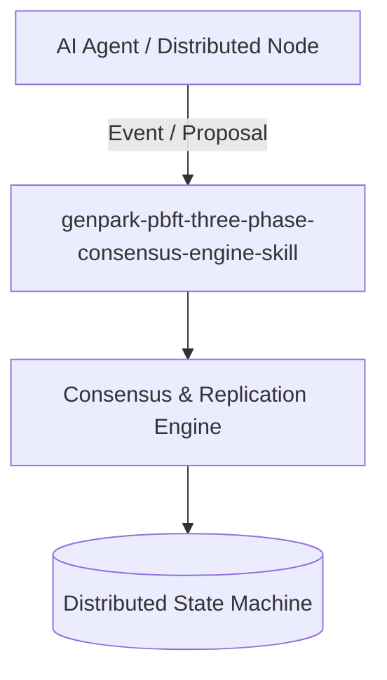

# genpark-pbft-three-phase-consensus-engine-skill

[](https://github.com/alphaparkinc/genpark-pbft-three-phase-consensus-engine-skill/actions)
[](https://opensource.org/licenses/MIT)
[](https://www.python.org/downloads/)

> Practical Byzantine Fault Tolerance (PBFT) engine executing Pre-Prepare, Prepare, and Commit phases with 2f+1 quorum verification.

## Architecture



## Features
- Pure standard library Python implementation with strictly zero pip dependencies.
- Mathematically provable distributed algorithms guaranteeing consistency and fault tolerance.
- Native Model Context Protocol (MCP) server support for multi-agent swarm synchronization.

## Installation

```bash
git clone https://github.com/alphaparkinc/genpark-pbft-three-phase-consensus-engine-skill.git
cd genpark-pbft-three-phase-consensus-engine-skill
```

## Quickstart

```bash
python example_usage.py
```
